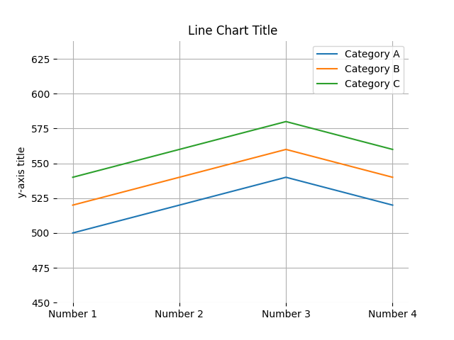
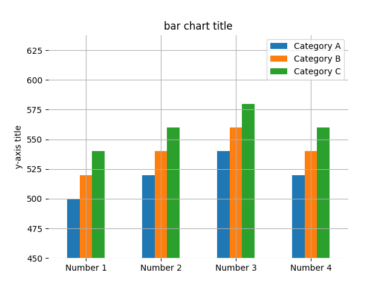
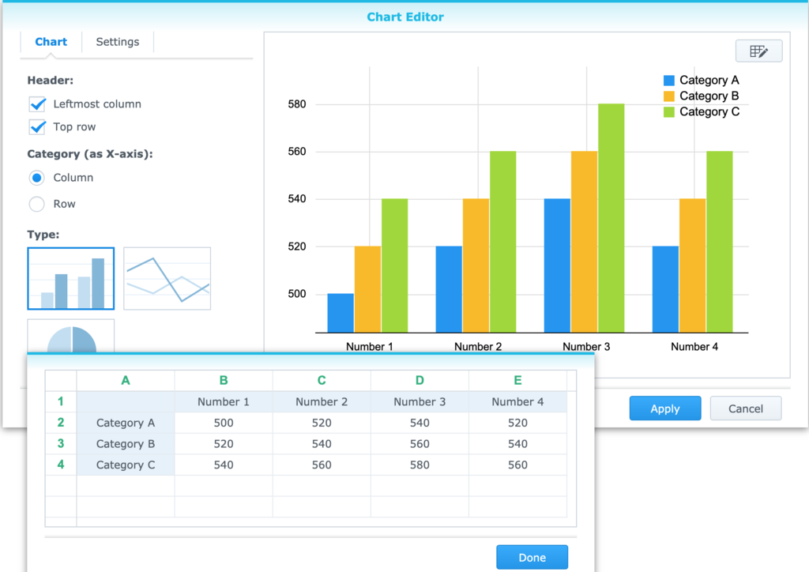

# This is H1

This is some more text

## This is H2

This is some more text

### This is H3

This is some more text

#### This is H4

This is some more text

##### This is H5

This is some more text

###### This is H6

This is some more text

This is <span style="background-color: #fff001;">highlighted</span> Text

This is <span style="text-decoration: line-through;">crossed</span> out

This is *italic*

This is **bold**

This is <u>underlined</u>

sub<sub>script</sub>

super<sup>script</sup>

1.  Number 1
2.  Number 2
    1.  Number sub 1
    2.  Number sub 2
3.  Number 3

-   Bullet 1
-   Bullet 2
    -   Sub bullet 1
    -   Sub bullet 2
        -   Sub sub bullet 
-   Bullet 3

	- [x] Check 1    
	- [ ] Check 2    
	- [ ] Sub check 1    
	- [x] Sub check 2    
		- [ ] Sub sub check 1    
		- [x] Sub sub check 2    
	- [ ] Check 3    

There is a horizontal line below this text

------------------------------------------------------------------------

There is a horizontal line above this text

Below is a 3x3 Table

<table data-border="1" style="width: 240px; height: 90px;"><thead><tr class="header"><th><strong>cell R1C1</strong></th><th><strong>cell R1C2</strong></th><th><strong>cell R1C3</strong></th></tr></thead><tbody><tr class="odd"><td><strong>cell R2C1</strong></td><td>cell R1C2</td><td>cell R1C3</td></tr><tr class="even"><td><strong>cell R3C1</strong></td><td>cell R1C2</td><td>cell R1C3</td></tr></tbody></table>

Pie Chart


[Chart data file](attachments/140415712695392.csv)

<table class="dataframe" data-border="1"><thead><tr class="header" style="text-align: right;"><th><strong></strong></th><th><strong>cost</strong></th><th><strong>price</strong></th><th><strong>value</strong></th><th><strong>total value</strong></th><th><strong>sum</strong></th><th><strong>percent</strong></th></tr></thead><tbody><tr class="odd"><th><strong>something</strong></th><td>500</td><td>520</td><td>540</td><td>520</td><td>2080</td><td>32.10</td></tr><tr class="even"><th><strong>something else</strong></th><td>520</td><td>540</td><td>560</td><td>540</td><td>2160</td><td>33.33</td></tr><tr class="odd"><th><strong>another thing</strong></th><td>540</td><td>560</td><td>580</td><td>560</td><td>2240</td><td>34.57</td></tr></tbody></table>

Line chart



[Chart data file](attachments/140415711946112.csv)

<table class="dataframe" data-border="1"><thead><tr class="header" style="text-align: right;"><th><strong></strong></th><th><strong>Number 1</strong></th><th><strong>Number 2</strong></th><th><strong>Number 3</strong></th><th><strong>Number 4</strong></th></tr></thead><tbody><tr class="odd"><th><strong>Category A</strong></th><td>500</td><td>520</td><td>540</td><td>520</td></tr><tr class="even"><th><strong>Category B</strong></th><td>520</td><td>540</td><td>560</td><td>540</td></tr><tr class="odd"><th><strong>Category C</strong></th><td>540</td><td>560</td><td>580</td><td>560</td></tr></tbody></table>

Below is a bar chart



[Chart data file](attachments/140415712046192.csv)

<table class="dataframe" data-border="1"><thead><tr class="header" style="text-align: right;"><th><strong></strong></th><th><strong>Number 1</strong></th><th><strong>Number 2</strong></th><th><strong>Number 3</strong></th><th><strong>Number 4</strong></th></tr></thead><tbody><tr class="odd"><th><strong>Category A</strong></th><td>500</td><td>520</td><td>540</td><td>520</td></tr><tr class="even"><th><strong>Category B</strong></th><td>520</td><td>540</td><td>560</td><td>540</td></tr><tr class="odd"><th><strong>Category C</strong></th><td>540</td><td>560</td><td>580</td><td>560</td></tr></tbody></table>

Below is an image of the design of the line chart as seen in note-station



Below is a hyperlink to the internet

<https://github.com/kevindurston21/YANOM-Note-O-Matic>

Below is a link to test page 2 inside of this notebook

[test page 2](../test/test-page-2.md)

Below is a renamed link to test page 2 inside of this notebook

[test page 2](../test/test-page-2.md)

Below is a a page in the 'Test Book 2' notebook

[Page linked to from test book](../test-book-2/page-linked-to-from-test-book.md)

Below is a renamed link to a page in this notebook

[renamed link to test page 3](notestation://remote/self/1026_1LRHUFL5U57TP9HI6RDC41U7LG)

Below is a link to a page that has a duplicated page title

[This is a duplicated title](../test-book-2/this-is-a-duplicated-title.md)  
[This is a duplicated title](../test-book-2/this-is-a-duplicated-title.md)  

An audio memo recording has been attached - it is silent because Note Station does not record correctly on my computers (if the feature actually works) but this shows it is exported.

An example-attachment.pdf has been attached

This page has 4 tags Tag1, Tag2, Tag1/SubTag1, Tag1/SubTag1/SubSubTag1. There will be near the top of the markdown file.

This is some code pasted into the note

```
if not files_to_convert:
    print('No .nsx files found')
    exit(1)
```

There is no way to insert 'code' in line in a Note.  Note formatted HTML does not use the &lt;code&gt; tag it just uses a &lt;pre&gt; tag so code is always it's own block even if only one word. Just like

```
while
```

this.

A pdf of what this page looks like in Note Station has been attached - see test page.pdf

This is the end of the text.

###### Attachments

[test-page.pdf](attachments/test-page.pdf)

[record-2021-02-15-160013.webm](attachments/record-2021-02-15-160013.webm)

[example-attachment.pdf](attachments/example-attachment.pdf)

